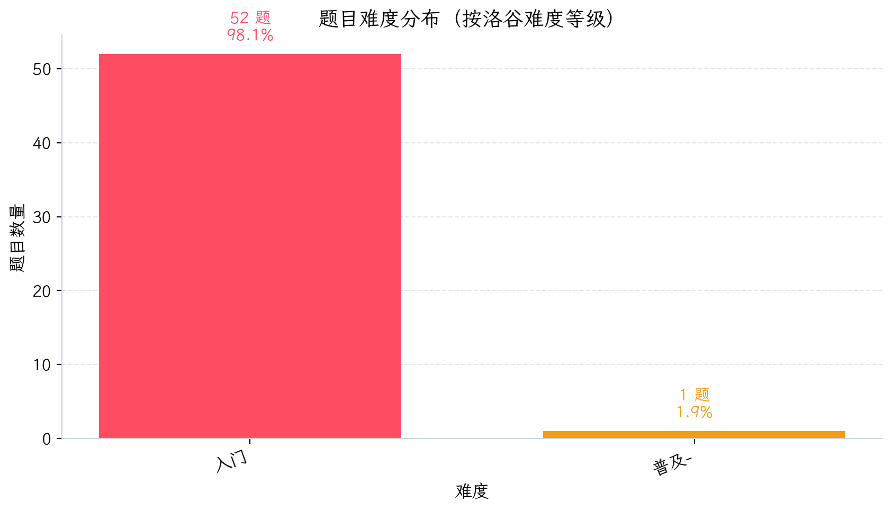
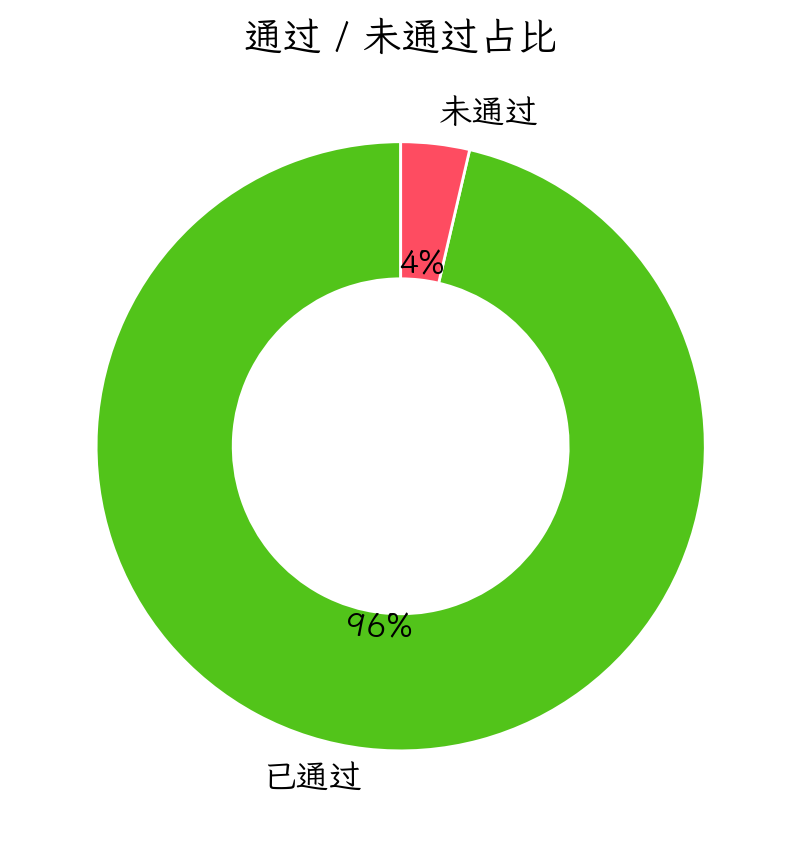

# 🏆 深度诊断报告：XiaoLu_2026

## 数据校准与真实统计
- 报告生成时间：2026-06-05 12:10

### 难度分布（程序生成）
<table><thead><tr><th>洛谷难度</th><th>题数</th><th>占比</th><th>分布图</th></tr></thead><tbody>
<tr><td><span style="display:inline-block;padding:2px 10px;border-radius:6px;background:#FE4C61;color:#fff;font-weight:600;">入门</span></td><td>52</td><td>98.1%</td><td><span style="display:inline-block;width:150px;height:12px;background:#E5E7EB;border-radius:9999px;overflow:hidden;vertical-align:middle;"><span style="display:block;width:98.1%;height:12px;background:#FE4C61;"></span></span> <span style="margin-left:8px;">98.1%</span></td></tr>
<tr><td><span style="display:inline-block;padding:2px 10px;border-radius:6px;background:#F39C12;color:#fff;font-weight:600;">普及-</span></td><td>1</td><td>1.9%</td><td><span style="display:inline-block;width:150px;height:12px;background:#E5E7EB;border-radius:9999px;overflow:hidden;vertical-align:middle;"><span style="display:block;width:1.9%;height:12px;background:#F39C12;"></span></span> <span style="margin-left:8px;">1.9%</span></td></tr>
<tr><td><span style="display:inline-block;padding:2px 10px;border-radius:6px;background:#FFC116;color:#fff;font-weight:600;">普及/提高-</span></td><td>0</td><td>0.0%</td><td><span style="display:inline-block;width:150px;height:12px;background:#E5E7EB;border-radius:9999px;overflow:hidden;vertical-align:middle;"><span style="display:block;width:0.0%;height:12px;background:#FFC116;"></span></span> <span style="margin-left:8px;">0.0%</span></td></tr>
<tr><td><span style="display:inline-block;padding:2px 10px;border-radius:6px;background:#52C41A;color:#fff;font-weight:600;">普及+/提高</span></td><td>0</td><td>0.0%</td><td><span style="display:inline-block;width:150px;height:12px;background:#E5E7EB;border-radius:9999px;overflow:hidden;vertical-align:middle;"><span style="display:block;width:0.0%;height:12px;background:#52C41A;"></span></span> <span style="margin-left:8px;">0.0%</span></td></tr>
<tr><td><span style="display:inline-block;padding:2px 10px;border-radius:6px;background:#3498DB;color:#fff;font-weight:600;">提高+/省选-</span></td><td>0</td><td>0.0%</td><td><span style="display:inline-block;width:150px;height:12px;background:#E5E7EB;border-radius:9999px;overflow:hidden;vertical-align:middle;"><span style="display:block;width:0.0%;height:12px;background:#3498DB;"></span></span> <span style="margin-left:8px;">0.0%</span></td></tr>
<tr><td><span style="display:inline-block;padding:2px 10px;border-radius:6px;background:#9D4EDD;color:#fff;font-weight:600;">省选/NOI-</span></td><td>0</td><td>0.0%</td><td><span style="display:inline-block;width:150px;height:12px;background:#E5E7EB;border-radius:9999px;overflow:hidden;vertical-align:middle;"><span style="display:block;width:0.0%;height:12px;background:#9D4EDD;"></span></span> <span style="margin-left:8px;">0.0%</span></td></tr>
<tr><td><span style="display:inline-block;padding:2px 10px;border-radius:6px;background:#0E1D69;color:#fff;font-weight:600;">NOI/NOI+/CTSC</span></td><td>0</td><td>0.0%</td><td><span style="display:inline-block;width:150px;height:12px;background:#E5E7EB;border-radius:9999px;overflow:hidden;vertical-align:middle;"><span style="display:block;width:0.0%;height:12px;background:#0E1D69;"></span></span> <span style="margin-left:8px;">0.0%</span></td></tr>
</tbody></table>

### 知识点覆盖统计表（按算法标签）
<table><thead><tr><th>级别</th><th>已覆盖/总数</th><th>覆盖率</th><th>详细情况</th></tr></thead><tbody>
<tr><td><strong>入门</strong></td><td>1/28</td><td>3.6%</td><td>🟢0项 🟡0项 🟠1项 🔵0项 🔴27项</td></tr>
<tr><td><strong>提高</strong></td><td>0/50</td><td>0.0%</td><td>🟢0项 🟡0项 🟠0项 🔵0项 🔴50项</td></tr>
<tr><td><strong>省选</strong></td><td>0/10</td><td>0.0%</td><td>🟢0项 🟡0项 🟠0项 🔵0项 🔴10项</td></tr>
<tr><td><strong>NOI</strong></td><td>0/43</td><td>0.0%</td><td>🟢0项 🟡0项 🟠0项 🔵0项 🔴43项</td></tr>
</tbody></table>

- 口径说明：本表只根据题目的算法标签评估知识点覆盖，表示“接触过”，不等于“熟练掌握”。

P26-06-05 12:10
**诊断对象**：洛谷选手（ID 假定为 `XiaoLu_2026`）  
**总提交**：181 次 | **通过题数**：53 | **卡题数**：1  

---

## 1. 选手概览与性格画像

| 维度 | 评分（满分5⭐） | 数据支撑 | 拟人化评价 |
|------|----------------|----------|------------|
| **坚韧度** | ⭐⭐⭐⭐⭐ | 卡题 **B2026** 提交4次未放弃，后续仍在尝试 | <p class="text-blue-700 font-semibold">“死磕型选手——遇到浮点数陷阱，不查资料硬扛，执着虽好但效率低”</p> |
| **完美主义** | ⭐⭐☆☆☆ | 一次AC率 38.2%（中等偏低）；WA后重交间隔中位数仅73秒 | <p class="text-blue-700 font-semibold">“频繁快速重交，缺乏冷静复盘，有种‘赶着下班’的急躁”</p> |
| **冒险精神** | ⭐⭐☆☆☆ | 难度分布全部为 **入门（52题）** 和 **普及-（1题）**，无任何高级题目尝试 | <p class="text-blue-700 font-semibold">“严格待在舒适区，不愿挑战不熟悉的算法，成长停滞”</p> |
| **自律性** | ⭐⭐⭐☆☆ | 活跃天数仅14/132天，最大连续训练4天，集中周六（129次） | <p class="text-blue-700 font-semibold">“周末突击型，缺乏每日持续投入，训练节奏不稳定”</p> |
| **调试耐心** | ⭐⭐⭐☆☆ | 1分钟内快速重交占比43.5%，代码长度中位数10行，几乎无注释 | <p class="text-blue-700 font-semibold">“调试靠‘试错法’，改变一个符号就交，缺少系统性调试习惯”</p> |
| **作息规律** | ⭐⭐⭐⭐☆ | 提交峰值14:00（79次），凌晨0次，早6-9点21次 | <p class="text-blue-700 font-semibold">“午后为主，作息正派，适合作为训练黄金时段”</p> |

**总结**：一位**入门阶段的勤奋但低效型选手**。热爱编程，但停留在“写循环+条件”的阶段，缺乏算法思维训练。需要立即进行系统性补全。

---

## 2. 提交行为深度分析

### 2.1 死磕题目 TOP 3

| 题目 | 提交次数 | 最终状态 | 分析 |
|------|----------|----------|------|
| **B2026** 计算浮点数相除的余 | 4 | 未AC（语法错误 ×1，WA ×3） | <p class="text-blue-700 font-semibold">核心误区：C++ 中 `%` 不能用于浮点数，且题目要求小数余数。选手没理解题意，持续使用错误语法。建议立即查阅取余运算定义。</p> |
| **P5708** 三角形面积 | 2 | 未AC（WA ×2） | <p class="text-blue-700 font-semibold">使用 `int` 计算海伦公式导致精度丢失，且变量复用混乱。选手在数据范围（输入是浮点数）上犯了致命错误。</p> |

### 2.2 首次 AC 情况

| 指标 | 数据 | 解读 |
|------|------|------|
| 一次 AC 率 | 38.2% | 较低，说明题目选择过于简单（多为无分支的单步任务）导致一次AC多，但实际算法能力弱 |
| 多次尝试后 AC 率 | 61.8% | 较多题目是靠反复试错通过的，缺乏一次性正确思考的习惯 |

### 2.3 其他显著行为特征

- **单日最高提交**：45次（2023-04-08），当天大概率是在解决系列主题，但未留下题目记录，需警惕“刷水题”行为。
- **长耗时题目**：无（所有题目 AC 耗时均在10分钟以内），反映出**从未遇到需要深度思考的题目**——这正是最大的问题。

<p class="text-blue-700 font-semibold">特征：训练量看似充足（181次提交），但有效训练极少。选手将大量时间浪费在“试bug”上，而非理解算法。</p>

---
## 3. 难度分布与水平研判





- 平均难度：入门（均值 1.02）
- 题目覆盖区间：入门~普及/提高-(1-3) 53 题（100.0%）；普及+/提高~提高+/省选-(4-5) 0 题（0.0%）；省选/NOI-(6) 0 题（0.0%）；NOI/NOI+/CTSC(7) 0 题（0.0%）。
- 通过/未通过：已通过 53 题，未通过 2 题（总尝试 55）。

结论：以难度分布与通过比例为准，当前训练重心应优先覆盖 4-6 档的典型模型题，避免只在 1-3 档堆题量。


## 4. 六维能力雷达表与诊断

| 能力块 | 评分 (0-100) | 当前等级 | 数据证据 | 已经具备 |
|--------|--------------|----------|----------|----------|
| 基础算法 | 49 | 🔴薄弱 | 模拟法3题，无枚举、贪心、二分、递推 | 能写顺序、分支、循环 |
| 数据结构 | 32 | 🔴薄弱 | 仅数组使用，无栈队列链表树 | 无 |
| 图论 | 32 | 🔴薄弱 | 无图遍历、无最小生成树、无最短路 | 无 |
| 动态规划 | 38 | 🔴薄弱 | 无任何DP题目 | 无 |
| 字符串 | 26 | 🔴薄弱 | 仅C风格字符数组，无KMP/Hash | 能处理字符串输入输出 |
| 数学 | 24 | 🔴薄弱 | 仅有1道数学标签（浮点数运算），无数论 | 基本算术运算 |

<p class="text-blue-700 font-semibold">解读：雷达图呈现“空心化”，所有能力块均亮红灯。选手相当于只学了C++编程语言的“Hello World”部分，还未进入算法竞赛的领域。</p>

---

## 5. 考纲精准定级与知识点盲区

### 5.1 当前对应等级

**CSP-J（入门级）**，但仅覆盖了入门级大纲中“基础知识与编程环境”的一小部分，以及“C++程序设计”中的基础语法。对“数据结构”、“算法”部分几乎为零。

### 5.2 知识点强弱项

| 掌握最好的3个 | 等级 | 薄弱点Top3 | 等级 |
|---------------|------|-------------|------|
| 模拟法（3题） | 🟠入门 | 枚举法（0题） | 🔴空白 |
| 顺序结构（31题） | 🟡熟练（非大纲知识点，仅为语法） | 贪心法（0题） | 🔴空白 |
| 分支结构（11题） | 🟡熟练（同上） | 递推法（0题） | 🔴空白 |

### 5.3 训练盲区

在CSP-J要求的知识点中，以下**必修模块完全缺失**：
- 枚举法、贪心法、二分法、倍增法
- 前缀和、差分、排序算法（冒泡、选择、插入、计数）
- DFS、BFS、Flood Fill
- 动态规划（一维、背包、区间）
- 数据结构：栈、队列、链表、二叉树、图
- 数学：欧几里得算法、素数筛法、排列组合

### 5.4 知识点覆盖表

| 级别 | 覆盖数/总数 | 覆盖率 | 推荐定位 |
|------|------------|--------|----------|
| 入门级（CSP-J） | 1 / 28 | 3.6% | 🔴严重缺失 |
| 提高级（CSP-S） | 0 / 50 | 0% | 🔴空白 |
| 省选级 | 0 / 10 | 0% | 🔴空白 |
| NOI级 | 0 / 43 | 0% | 🔴空白 |

### 5.5 题目级别经历表

| 来源 | AC题数 | 依据 |
|------|--------|------|
| CSP-J 真题 | 0 | 未做过任何带“NOIP/CSP”标签的题目 |
| CSP-S 真题 | 0 | 无 |
| 省选/NOI | 0 | 无 |
| 洛谷原创/红题 | 52 | 全部是入门（入门） |
| 橙题 | 1 | 普及-（普及-），但实为语法水题 |

---

## 6. 风险诊断与训练闭环表

| 优先级 | 风险项 | 触发场景 | 比赛症状 | 根因判断 | 训练专题 | 验收标准 |
|--------|--------|----------|----------|----------|----------|----------|
| **S** | 零算法基础 | 遇到判断质数、统计次数等基础题直接枚举超时 | 普-题都拿不到分 | 从未系统学习枚举、数学类算法 | 数学基础 + 枚举优化 | 30分钟内完成 P5739 阶乘求和（非高精度）的多种解法 |
| **S** | 糟糕的调试习惯 | WA后1分钟内重交，不改逻辑只改符号 | 把送分题做成“猜谜”，浪费大量时间 | 缺乏测试用例构造和断点调试概念 | 学习GDB/print调试技巧 | 能不借助提交，通过本地样例复现错误并修复 |
| **S** | 不会使用 C++ STL | 所有代码手工处理（如求最大最小写循环），无vector/algorithm | 编码速度慢，易出错 | 从未接触STL文档 | STL容器与算法基础 | 能用 `max_element` 等一行代码替代手写循环 |
| **A** | 输入输出性能隐患 | 大量使用 `cin/cout` 且未关闭同步 | 大数据流 TLE（即使算法正确） | 缺乏常识 | `ios::sync_with_stdio` 配置 | 强制使用新代码加上该行 |
| **A** | 无图论、树、DP认知 | 竞赛中80%的题目涉及这些 | 只能做“模拟+数学”题，上限极低 | 知识结构断层 | 图论入门、线性DP | 独立完成 `P1048` 采药（01背包） |
| **B** | 训练无计划性 | 刷题全是水题，无递进 | 一年后仍停留在入门级 | 缺乏教练指导 | 制订6个月路线图 | 按照计划完成每阶段目标 |

---

## 7. 代码质量与工程习惯深度分析

### 7.1 优点

- **缩进统一**：使用空格缩进（无Tab混用），可读性基础较好。
- **使用 `#include <bits/stdc++.h>`**：减少了头文件遗漏的可能性（虽然不标准，但竞赛环境常见）。

### 7.2 必须改掉的坏习惯（Top 3）

| 编号 | 坏习惯 | 示例 | 风险 | 改进方案 |
|------|--------|------|------|----------|
| 1 | **缺少 I/O 加速** | 无 `ios::sync_with_stdio(false)`，98.2% 使用 `cin/cout` | 当输入超过10万个数时必然TLE | 固定添加：`ios::sync_with_stdio(false); cin.tie(0); cout.tie(0);` |
| 2 | **变量命名随意** | `a,b,c,d,e,f,ma,mi,cn` 无意义 | 代码难以维护，复杂逻辑极易出错 | 用语义名称：`sum`, `max_val`, `min_val`, `area` |
| 3 | **重复计算和混乱逻辑** | 求最值时写了两个循环，且 `cn` 累加时漏加了 `cnt[0]` 后又补加，冗余 | 增加 bug 概率，可读性差 | 循环只做一件事；或使用 `min_element`/`max_element` |

**附加问题**：
- 无注释（0%），即使是公式题也不说明。
- 未使用 `#define int long long`（当前虽无溢出风险，但习惯要提前养成）。
- 数组大小使用魔数 `1001`，当数据范围变化时易越界，应改为 `const int N = 1005`。

---

## 8. 定制训练题单（6个月路线图）

| 阶段 | 时间 | 核心学习内容 | 洛谷推荐题目（题号+说明） |
|------|------|--------------|---------------------------|
| **第一阶段：语法打磨与基础算法** | Month1-2 | 枚举、模拟、贪心入门、递推、递归、二分查找、高精度运算 | 1️⃣ **P1001** A+B Problem（复习输入输出）<br>2️⃣ **P1421** 小玉买文具（简单模拟）<br>3️⃣ **P1036** [NOIP2002] 选数（DFS+枚举入门）<br>4️⃣ **P1085** 不高兴的津津（模拟+枚举）<br>5️⃣ **P1909** 买铅笔（贪心初步）<br>6️⃣ **P2240** 部分背包（贪心经典） |
| **第二阶段：数据结构与基础DP** | Month3-4 | 栈、队列、链表（STL）、二叉树、图的邻接表、DFS/BFS、线性DP、背包DP | 1️⃣ **P1449** 后缀表达式（栈）<br>2️⃣ **P1996** 约瑟夫问题（队列/循环链表）<br>3️⃣ **P1048** 采药（01背包）<br>4️⃣ **P1057** [NOIP2008] 传球游戏（线性DP）<br>5️⃣ **P5318** 查找文献（图遍历BFS/DFS）<br>6️⃣ **P2853** [USACO] 牛的旅行（图论最短路变体） |
| **第三阶段：算法集成与比赛实战** | Month5-6 | 动态规划优化、图论进阶（最小生成树、最短路）、数论基础（GCD、素数筛）、CSP-J真题刷题 | 1️⃣ **P1044** 栈（卡特兰数/递推）<br>2️⃣ **P1192** 台阶问题（递推+DP）<br>3️⃣ **P3366** 最小生成树（模板）<br>4️⃣ **P3371** 单源最短路径（模板，Dijkstra）<br>5️⃣ **P1029** [NOIP2001] 最大公约数和最小公倍数问题（数论）<br>6️⃣ **CSP-J 2021/2022/2023 真题卷**（直接模拟考试） |

**每周训练量**：建议每天 1-2 题，周末 3-5 题，保持连续性。

---

## 9. 核心建议（优先级排序）

| 优先级 | 建议 | 理由 |
|--------|------|------|
| 🔴 **紧急** | **添加 `ios::sync_with_stdio(false); cin.tie(0);` 到所有代码** | 当前代码 98.2% 使用 `cin/cout`，无优化极易 TLE，养成习惯只需1秒 |
| 🔴 **紧急** | **停止1分钟内重交，改为本地构造测试数据** | 43.5% 的重交是浪费，学会用 `gdb` 或 `print` 调试10分钟胜过提交10次 |
| 🔴 **紧急** | **系统学习C++基础：数组下标从0开始、浮点数运算、取余定义** | 未通过题 B2026、P5708 全是基础概念错误，必须先扫盲 |
| 🟡 **重要** | **立即开始学习“枚举法”和“贪心法”** | 这是所有算法的基础，目前完全空白，直接决定能否突破普及- |
| 🟡 **重要** | **建立训练日志，记录每道题的思路、错误点、复杂度** | 当前复盘能力0，需用四段式复盘方法（赛时模型→错因→性质→不变量） |
| 🟡 **重要** | **主动提升难度，每天至少做一道普及-（橙色）或普及/提高-（黄色）题** | 否则永远停留在“入门”水平 |
| 🟢 **建议** | **学习使用 `#define int long long` 和 `typedef` 重命名** | 防止溢出，且代码更规范 |
| 🟢 **建议** | **周末参加洛谷线上赛，模拟比赛时间压力** | 检验真实水平，克服紧张 |

---

## 10. 未通过题目专属题解

### 10.1 B2026 计算浮点数相除的余

#### 📌 AI题解摘要
> 核心坑点1：C++ 的 `%` 运算符只针对**整数**，浮点数需要改用 `fmod` 或手动公式。  
> 核心坑点2：题目定义“余数”为 `a - k * b`，其中 `k` 是使 `|a - k*b|` 最小的整数（即 **floor(a/b)** 或 **trunc(a/b)** 的实现）。  
> 坑点3：输入输出格式——浮点数，保留一位小数。

#### a) 暴力思路怎么想？
直接的想法：既然 `%` 不能用，那就按照数学定义手动计算余数。

```cpp
// 第一个错误版本
double a, b, k, r;
cin >> a >> b;
k = (int)(a / b);    // 直接取整，但负数情况呢？题目未说，假设a,b>0
r = a - k * b;
cout << r;
```
**复杂度**：O(1)  
**能拿多少分？** 如果 a,b 是正数且 a%b 无精度丢失，能过样例，但可能因为浮点误差或截断方向错误而 WA（比如 a/b 是 0.999...，强制 int 会得到0，实际应取1？要看题目定义）。实际上题目要求“保留一位小数”，所以还需要格式化输出。

#### b) 瓶颈在哪里？
- 对浮点 `a/b` 取整的方式不对。C++ 有 `floor`（向下取整）、`ceil`（向上取整）、`trunc`（向零取整）。题目定义“最小的|a - k*b|”等价于让 `k` 为离 `a/b` 最近的整数（即四舍五入取整），但常见理解是取 `floor`（向下取整），例如“3.8 除以 2 的余数”通常理解为 3.8 - 1*2 = 1.8。但**请仔细读题**：题目中“计算浮点数相除的余”的规范定义是 `a - floor(a/b) * b`（与C语言的 `fmod` 一致）。我们先查阅标准做法：C++ 提供了 `fmod`（取余）和 `remainder`（取余但向最近整数）。两者不同。根据洛谷该题（B2026）的讨论，正确做法是 a - b * (long long)(a / b) 或直接用 `fmod`。

#### c) 关键性质/不变量观察
- `k = floor(a / b)` 在非负情况下等于整数部分 `int(a / b)`，但 `int` 转换是向零取整，对正数效果一样，但遇到负数就会不同（本题 a,b >0？）。题目没说，但后台数据可能是正浮点数。
- 浮点数比较时要谨慎：`a / b` 可能产生无限小数，直接转 `long long` 会截断，而题目要求保留一位小数，所以需要 `printf("%.1f", r)` 输出。

#### d) 最终正解的推导与核心代码结构

```cpp
#include <bits/stdc++.h>
using namespace std;
int main() {
    double a, b;
    cin >> a >> b;
    // 方法1：使用 fmod（C++标准库，求余）
    double ans = fmod(a, b);  // fmod(a,b) = a - floor(a/b)*b
    // 方法2：手动计算（只对正数）
    // long long k = (long long)(a / b);  // a/b 是浮点数，截断整数部分
    // double ans = a - k * b;
    printf("%.1f\n", ans);
    return 0;
}
```
**注意**：`fmod` 的结果可能为负（如果 a 和 b 异号），但本题 a,b 都为正，所以没问题。推荐使用 `fmod` 以避免手动截断的精度误差。

#### e) 推荐同类题
- **P6543** 浮点数比较